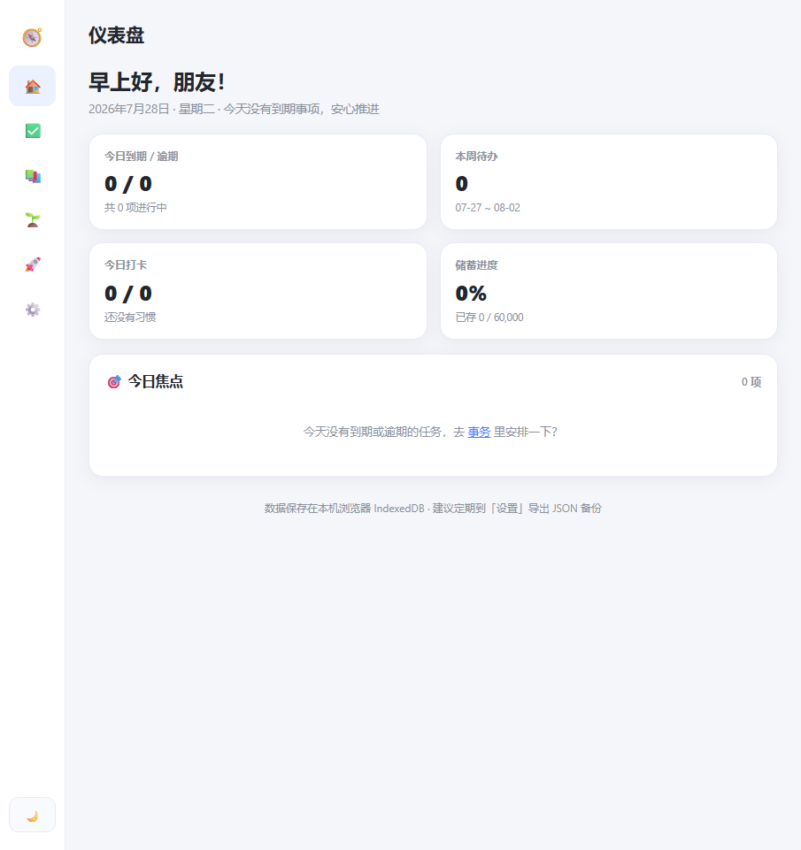
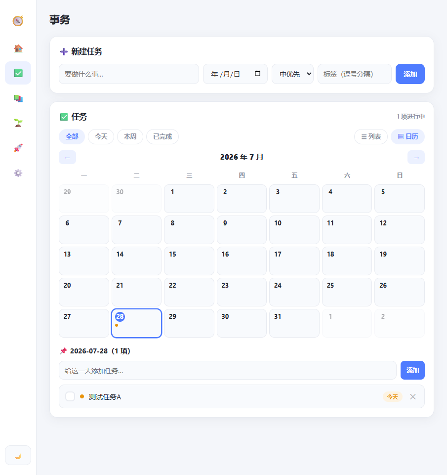
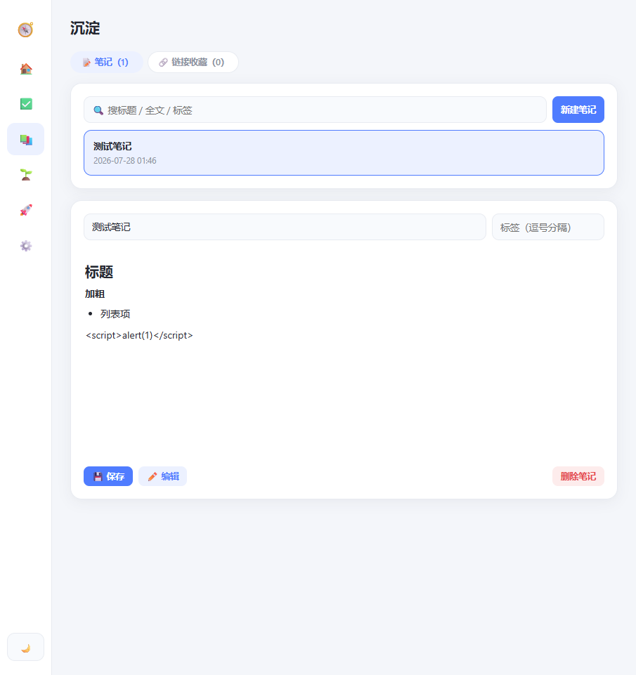
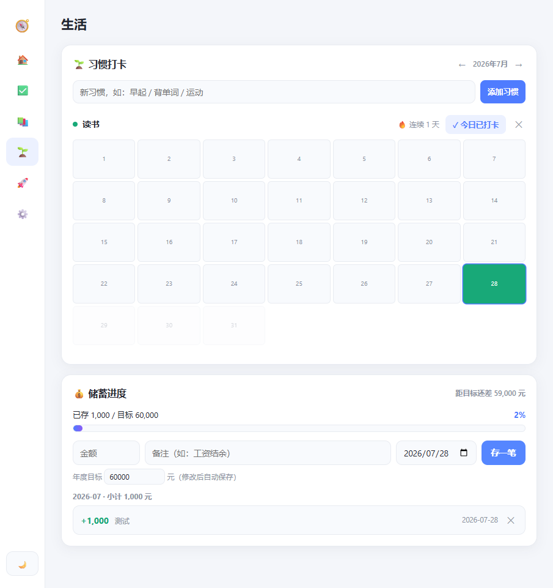
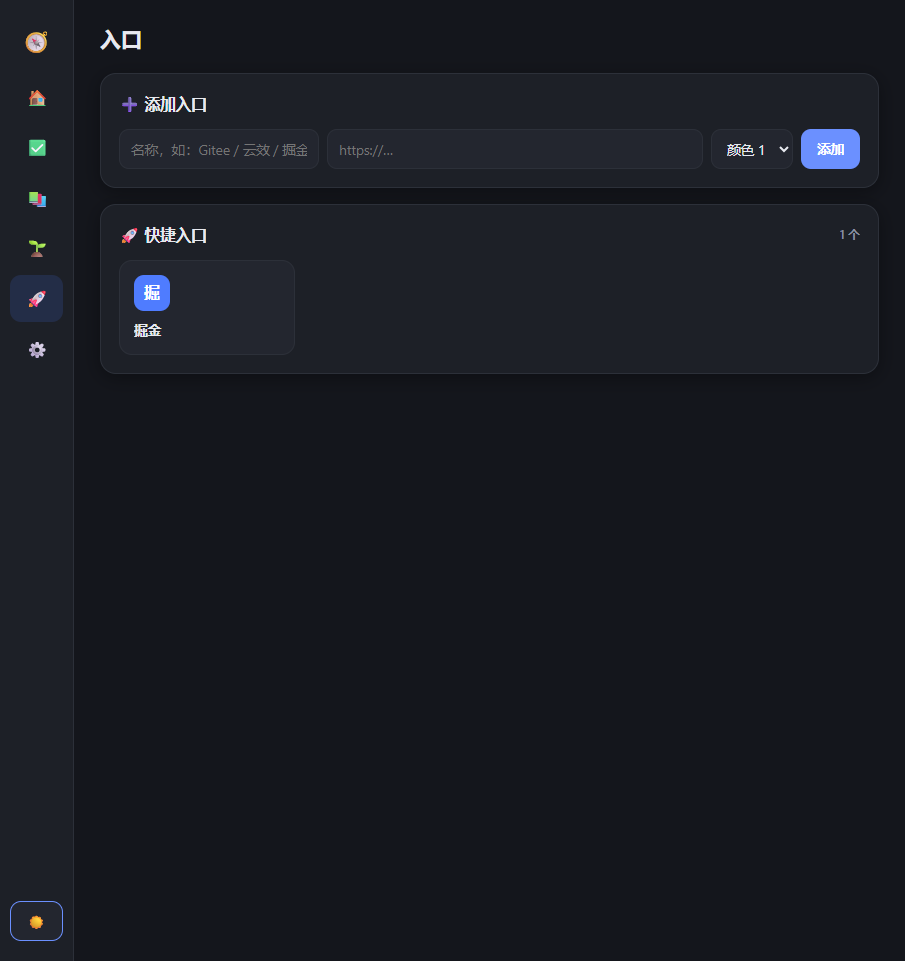
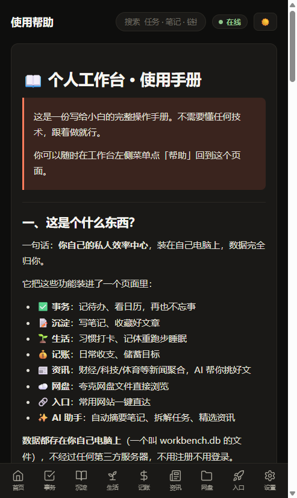

# 📊 我的仪表盘（Personal Workbench）

自托管 · 零构建 · 原生 JS 的个人效率仪表盘 —— 任务、笔记、习惯打卡、记账、健康记录、RSS 资讯、夸克网盘浏览、快捷入口，全部装进一个页面，数据完全归你。

> **零依赖硬约束**：无 npm、无打包器、无框架、无模板引擎，纯 Python + 原生 JS + SQLite，`git clone` 即可运行。

---

## ✨ 功能特性

| 模块 | 说明 |
|------|------|
| 🏠 **仪表盘** | 今日待办 / 习惯完成 / 最新资讯总览，考公倒计时横幅，净资产 + 今日盈亏，到期浏览器通知，AI 每周回顾 |
| ✅ **事务** | 待办任务 + 月历视图，重复任务（🔁），逾期一键顺延，✨ AI 大目标拆解 |
| 📚 **考公中心** | 考试节点倒计时（3 天红卡提醒）、模考记录 + 成绩趋势图 + 同科目涨跌对比、复习进度、备考清单、习惯打卡、笔记速览 |
| 📝 **沉淀** | Markdown 笔记 + ✨ AI 摘要标签、链接收藏（自动抓标题、RSS 收藏同步） |
| 🌱 **生活** | 习惯打卡热力图 + 里程碑祝贺、体重 / 跑步 / 睡眠健康记录 + 30 天趋势 |
| 💰 **记账** | 收支流水 + 月/年统计图表、月度预算预警、固定支出模板、储蓄目标、CSV / xlsx 导入导出 |
| 📰 **资讯** | 6 大分类 RSS 聚合，关注词高亮置顶，已读变灰，AI 今日精选，自定义 RSS 源，考公招考公告直达 |
| ☁️ **网盘** | 夸克网盘文件浏览 + 下载链接获取（配置 Cookie 即可） |
| 🔗 **入口** | 常用网站卡片，拖动排序 |
| ✨ **AI 助手** | 笔记摘要、任务拆解、资讯精选（智谱 GLM，Key 只在服务端） |

**多用户支持**：预设账号制（不开放注册），管理员可建号 / 重置密码 / 删号，每个账号数据完全隔离（独立数据库文件）。

## 🖼️ 界面预览

| 仪表盘 | 任务 + 日历 | 笔记 |
|---|---|---|
|  |  |  |

| 生活健康 | 暗色主题 | 帮助手册 |
|---|---|---|
|  |  |  |

## 🚀 快速开始

**依赖**：Python 3.9+，`pip install fastapi uvicorn`

```bash
# 1. 拉代码
git clone https://github.com/ximiedeyanhuo/workbench.git
cd workbench

# 2. 启动（Windows 也可直接双击 启动工作台.bat）
python server.py

# 3. 浏览器打开
# http://localhost:8642
```

**首次登录**：用户名 `admin`，初始密码 `admin123`，登录后请立即在「设置 → 账号」改掉初始密码。

> 服务默认绑定 `0.0.0.0:8642`（`HOST` / `PORT` 在 server.py 顶部）。离线 / 本地模式不需要登录，走浏览器 IndexedDB 缓存。

## 🧠 AI 功能（可选）

在项目根目录新建 `zhipu.key` 文件写入智谱 API Key（或设置环境变量 `ZHIPU_API_KEY`），重启服务即启用。默认模型 `glm-4.5-air`（可用环境变量 `ZHIPU_MODEL` 覆盖），Key 只存服务端，AI 结果一律需人工确认才生效。

## 🛡️ 数据与安全

- **本地存储**：数据全部存在服务器 SQLite（每用户独立库文件），不经过任何第三方
- **按用户隔离**：登录用户路由到各自 `workbench_<用户名>.db`
- **自动备份**：服务启动时自动备份全部库到 `backups/`，每库保留最近 7 份
- **手动备份**：设置页可一键导出全部数据为 JSON / 导入恢复
- **安全**：PBKDF2 密码哈希 + HttpOnly Cookie 会话（30 天）+ 登录防爆破锁定 + 全接口 401 鉴权拦截；RSS 代理内置 SSRF 内网拦截
- **敏感文件不入库**：`zhipu.key`、`users.json`、`sessions.json`、`*.db`、`backups/` 均已写入 `.gitignore`

## 📦 部署

- **VPS 部署**（systemd 自启 / nginx HTTPS / Tailscale / SSH 隧道）→ [DEPLOY.md](DEPLOY.md)
- **手机 Termux 部署**（本地运行 + PWA 装到桌面）→ [TERMUX.md](TERMUX.md)

## 🏗️ 技术架构

| 层 | 实现 |
|----|------|
| 后端 | 单文件 `server.py`：FastAPI + SQLite WAL，通用 CRUD + RSS/AI 代理 + 用户体系 |
| 前端 | 原生 JS Hash-SPA（全局命名空间 `WB`），无框架 |
| 数据层 | `js/db.js` 惰性仓库代理：在线走 API，离线自动回退 IndexedDB |
| 离线 | Service Worker（`sw.js`）stale-while-revalidate，静态资源可离线运行 |
| PWA | `manifest.json` + 图标，可安装到桌面 / 手机主屏 |
| 样式 | `css/app.css` 单文件，CSS 变量驱动明暗主题 |

## 📁 项目结构

```
workbench/
├── server.py            # 后端单文件（FastAPI + SQLite + 鉴权 + RSS/AI 代理）
├── index.html           # 入口页
├── css/app.css          # 全部样式
├── js/                  # 前端业务模块（原生 JS）
│   ├── app.js           # 路由 / 启动门控
│   ├── db.js            # 数据层（ApiRepository / IndexedDB 双后端）
│   └── tasks / notes / life / finance / news / drive / links / stocks / gongkao.js
├── lib/                 # 本地第三方库（Chart.js / SheetJS / Markdown）
├── sw.js                # Service Worker（PWA 离线缓存）
├── manifest.json        # PWA 清单
├── HELP.md              # 小白使用手册（页面内「帮助」直接渲染）
├── AGENTS.md            # 开发者指南（架构约定 / 踩坑记录）
├── DEPLOY.md            # VPS 部署指南
├── TERMUX.md            # Termux 手机部署指南
└── 启动工作台.bat        # Windows 一键启动
```

## 📚 文档索引

- **[HELP.md](HELP.md)** — 面向小白的功能使用手册
- **[AGENTS.md](AGENTS.md)** — 开发者架构指南（存储约定、测试约定、已知坑）
- **[DEPLOY.md](DEPLOY.md)** — VPS 部署与安全加固
- **[TERMUX.md](TERMUX.md)** — Termux 手机部署
